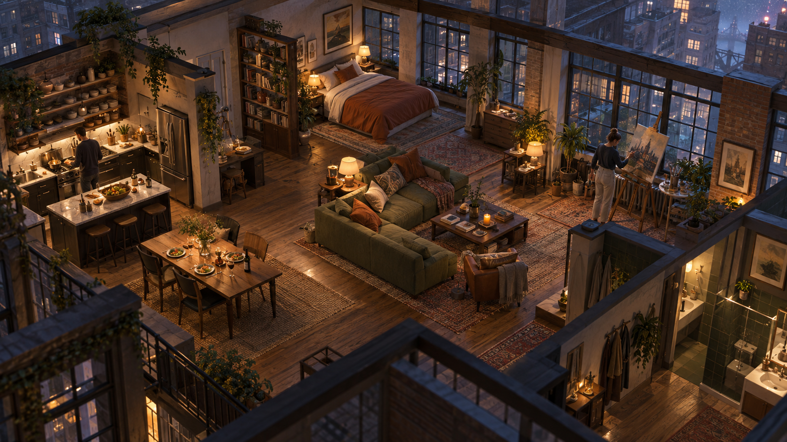

# Cinematic loft revision

September 10, 2026. Proposed visual pass after the user's explicit rejection of the proof's cinematic/realistic fidelity. Akito approved the concept target: “Yes—match this cinematic loft.” Implementation is in progress.

## Context and target

The gameplay proof works, but its sharp primitive geometry, mostly flat materials, simple sun/fill lighting and empty background fall below the requested visual bar. The user accepts the general style and supplied Anshu's Afterlight reference. See [primary-source observations](reference-notes.md). This is a visual-production gap; the reference does not establish that browser delivery must be abandoned.

This generated image is a direction reference only. It is not a captured playable scene, exact floor plan, performance claim or promise of achieved fidelity. Its extra bathroom/architectural details do not add new game mechanics. Existing collision coordinates remain authoritative unless a separate layout change is deliberately validated.

Keep the current warm, lived-in loft identity. Aim for physically convincing wood, plaster, metal, glass and textiles; modeled furniture edges/cushions/joinery; layered city architecture through windows; warm practical lights against cool evening light; contact shadows and restrained atmosphere. Preserve natural proportions and clear walking routes. Large panels should recede during play so the scene is the focal point.

## Approach

1. **Establish one measured visual baseline.** Capture the current loft from a fixed camera at desktop resolution and record frame time. Use one furnished corner as the first comparison gate. Prioritize silhouette, material response, shadows and composition over particles or decorative effects.
2. **Build a coherent asset set.** Use Blender for the sofa, bed, kitchen cabinetry, table, window frames and architectural trim; export reusable GLBs with named materials, correct scale and pivots. Model cloth shape rather than applying a flat fabric image to a cube. Generated images may guide art direction or supply cleaned texture inputs; they are not automatically physically valid normal/roughness maps.
3. **Rework materials and lighting.** Apply PBR materials with sensible roughness/normal detail and environment lighting. Add local lamp light, ambient occlusion/contact grounding, calibrated exposure and restrained bloom. Any baked static lighting must remain compatible with moving people and dynamic shadows. Avoid effects that obscure interactions or merely hide weak geometry.
4. **Give the home a setting.** Replace flat window illustrations with layered facade/roof geometry and depth cues. Reframe the camera closer while retaining orbit/follow and useful mobile framing. Keep the interface's visual language, reducing its visual dominance where it obstructs the scene.
5. **Resolve character mismatch.** Match scale, palette and shading to the new room; explicitly assess the present low-detail characters before claiming realism. Detailed environments alone will not make these figures or generic interaction clips realistic. More detailed rigged people and appropriate animation are a separate asset milestone if the mismatch persists.
6. **Compare actual frames and play.** Capture the same views after each pass, inspect alongside the target, fix the largest remaining perceptual gap, then repeat. Only expand the treatment across the room when the first corner demonstrates a meaningful improvement. Preserve current presets, but do not claim three equally polished worlds after a one-loft pass.

## Proposed files

- `client/src/life-scene.ts`: replace primitive prop construction with asset instances, integrate camera/composition changes and preserve object/resident picking.
- `client/src/life-materials.ts`: reusable material loading and environment/lighting setup if separating these responsibilities reduces scene complexity.
- `client/public/life-assets/cinematic/`: exported GLBs and optimized maps consumed by the browser.
- `art/blender/`: reproducible source scripts and source assets for the exported geometry.
- `client/src/life-style.css` and `life-main.ts`: only the interface adjustments needed to expose the scene without losing access to controls.
- `LIFE_ASSET_CREDITS.md`: new source and license provenance; retain source asset rights in any public distribution.
- `LIFE_VERIFICATION.md`: measured visual/performance and interaction results.

## Verification and acceptance

- Actual controllable 3D is required. A generated still or video cannot satisfy the visual milestone.
- Compare identical gameplay camera angles, including the whole room and a close furniture view; assess geometry, material variation, grounded shadows, depth and character fit separately.
- Target 60 FPS on the demo machine, measure median/p95 frame time under movement with all three residents and effects; report actual results and reduce effects when needed. A target is not a guaranteed benchmark.
- Exercise all eight furniture interactions, floor picking, WASD, object selection, queued activity, live Astra reply, pause/speed, save/reload and theme changes after replacing assets.
- Inspect every preset in both interface themes; 390px portrait, production build and provider-offline mode remain regression checks.
- Do not claim visual parity until the rendered scene earns it. First visual checkpoint is roughly 60–90 minutes after tool/asset setup, an estimate rather than a delivery promise. A complete room pass may take several more hours and must be weighed against the 17:30 submission deadline.

## Tooling and open decisions

Blender 5.2.1 is installed at `/Applications/Blender.app` and has generated the furniture assets through its command-line interface. No Blender add-on or MCP connector is needed. Unity is unnecessary for this browser approach; changing engines would add work without supplying the missing art assets. Blender can also run reproducible scripts without an MCP connector once installed.

The user approved the visual target and installed Blender 5.2.1. Eleven detailed GLB assets, scanned PBR materials, city geometry and a reworked lighting/grade pass are integrated and committed, and the production bundle has been rebuilt. Step 5 of the approach remains the honest open item: the low-detail characters are now the largest visible fidelity gap, and detailed rigged people are a separate asset milestone that was not attempted. The user rejected the mid-pass result as still stylized rather than photorealistic; the follow-up targeted lighting rather than geometry, which is where the cited reference's own author locates its realism. Measured results and the fidelity statement are in `../LIFE_VERIFICATION.md`.

## Self-review

The plan addresses the reported visual failure through asset production and lighting, rather than promising that post-processing can fix primitive silhouettes. It does not copy the reference's dystopian setting into the user's life-sim. Its weak point is still detailed character/animation availability; that must be evaluated explicitly. It protects working gameplay, uses measured frame time and rendered comparisons, and separates a visual checkpoint from a finished high-fidelity world.
